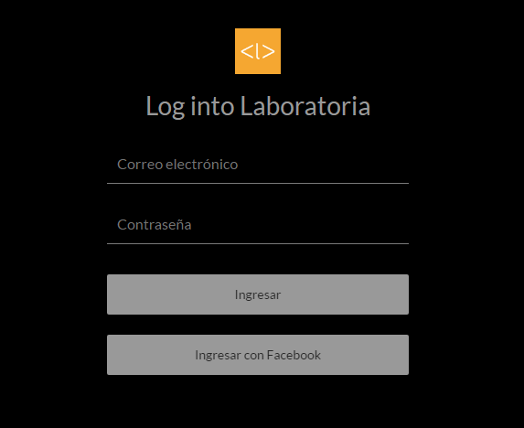
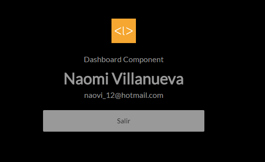

# FacebookLogin

Página Web para ingresar a la página de Laboratoria usando el correo eléctrónico o a través de nuestra cuenta de Facebook con el
SDK para JavaScript.

## Descripción del proyecto

Para este proyecto se está usando componentes en JS, el cual contiene los archivos de header, login y dashboard que nos renderiza
la página de ingreso a la cuenta de Laboratoria.

Consta de 6 secciones:

* Header: Ícono de Laboratoria.
* Login: Registro o ingreso de la cuenta.
* Dashboard: Confirmación del ingreso a la cuenta.

## API utilizada

Se utilizó la siguiente API: SDK para JavaScript de Facebook.

## Lanzamiento 

Esta es la versión final de la página web del <a href="https://naovillaj.github.io/FacebookLogin/">Facebook Login</a>

Login Facebook: 
 

Dashboard Facebook:
 

## Desarrollado con

Sublime 

* [HTML5] - Para la estructura de la página web
* [CSS3] - Para darle el estilo a la página web
* [JavaScript 1.8.5.] - Para las funcionalidades de la página web
* [Node JS] - Para levantar servidor local

## Autor

* **Naomi Villanueva** 
